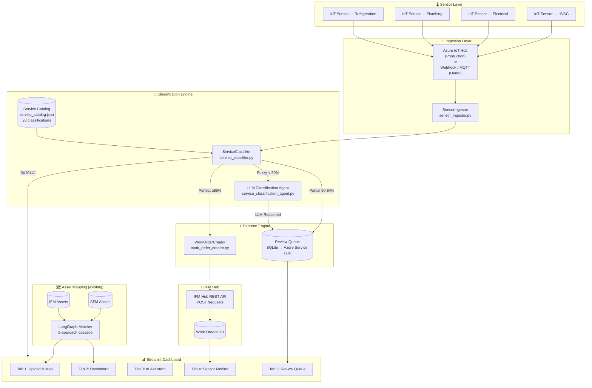
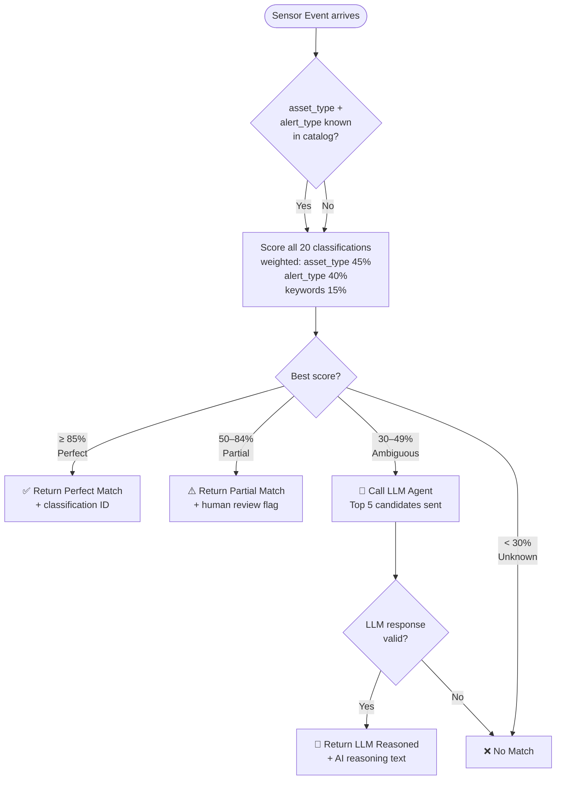
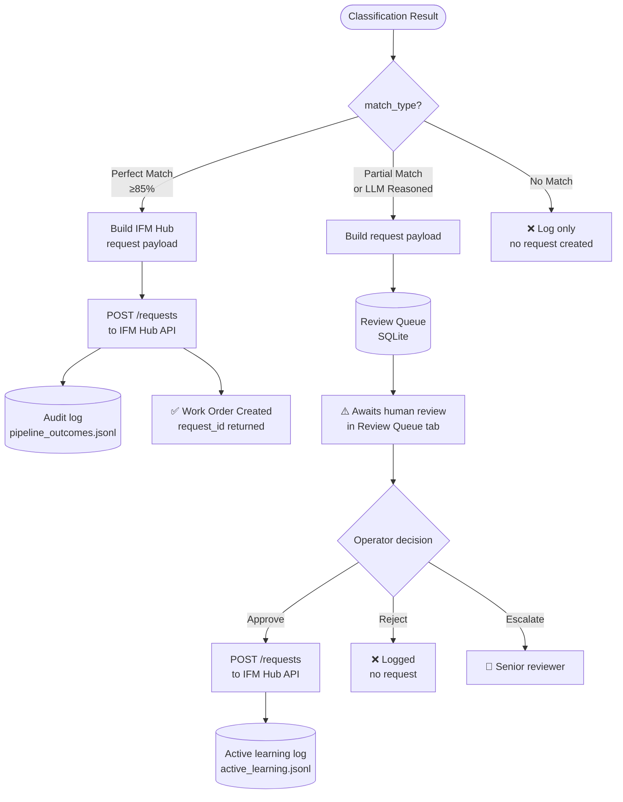
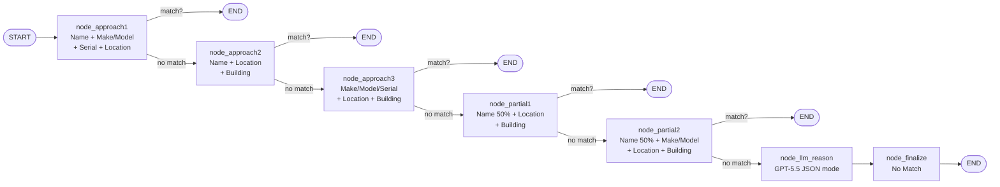
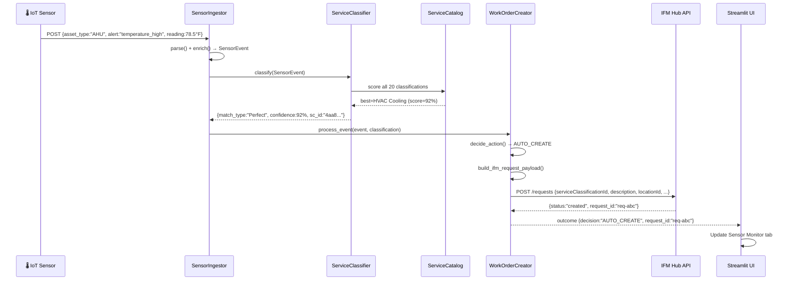
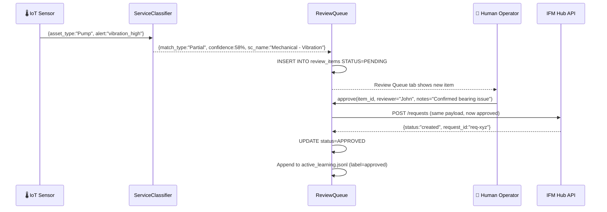
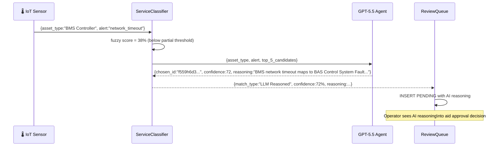
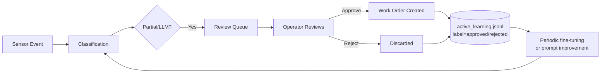

# SFM ↔ IFM AI Platform — Architecture Document

> Version 1.0 | May 2025 | Hackathon Edition

---

## Table of Contents

1. [Executive Summary](#1-executive-summary)
2. [High-Level Design (HLD)](#2-high-level-design-hld)
3. [Low-Level Design (LLD)](#3-low-level-design-lld)
4. [End-to-End Flow Diagrams](#4-end-to-end-flow-diagrams)
5. [Component Reference](#5-component-reference)
6. [Tech Stack](#6-tech-stack)
7. [Data Models](#7-data-models)
8. [IFM Hub API Contract](#8-ifm-hub-api-contract)
9. [Training Pipeline & Active Learning](#9-training-pipeline--active-learning)
10. [Security & Production Considerations](#10-security--production-considerations)
11. [Deployment Guide](#11-deployment-guide)

---

## 1. Executive Summary

The platform solves two connected problems:

| Problem | Solution |
|---|---|
| **Asset Mapping** — SFM assets need to be matched to IFM Hub assets | 5-approach fuzzy + LLM cascade (existing) |
| **Sensor → Work Order** — When a sensor alerts on an asset, the right IFM service classification must be found, and a work order auto-created (or queued for review) | New 4-tier classification pipeline + work order creator |

### Decision Rules (applies to both problems)

| Tier | Confidence | Action |
|---|---|---|
| 🟢 **Perfect Match** | ≥ 85 % | Auto-create work order in IFM Hub |
| 🟡 **Partial Match** | 50 – 84 % | Enqueue for human review |
| 🔵 **LLM Reasoned** | any | Enqueue for human review with AI explanation |
| 🔴 **No Match** | 0 % | Log only — no request created |

---

## 2. High-Level Design (HLD)



---

## 3. Low-Level Design (LLD)

### 3.1 Service Classification Engine



### 3.2 Work Order Decision Flow



### 3.3 Asset Mapping LangGraph Pipeline (existing)



---

## 4. End-to-End Flow Diagrams

### 4.1 Happy Path — Auto Work Order Creation



### 4.2 Partial Match — Human Review Path



### 4.3 LLM Reasoning Path



---

## 5. Component Reference

### Files Created / Modified

| File | Purpose | Status |
|---|---|---|
| `pipeline/sensor_ingestor.py` | Sensor event model + ingestion | ✅ New |
| `pipeline/service_classifier.py` | 4-tier classification engine | ✅ New |
| `pipeline/work_order_creator.py` | IFM Hub API client + decision engine | ✅ New |
| `pipeline/review_queue.py` | SQLite review queue | ✅ New |
| `pipeline/orchestrator.py` | E2E pipeline orchestration | ✅ New |
| `pipeline/matcher.py` | 5-approach fuzzy asset matcher | ✅ Existing |
| `pipeline/langgraph_agent.py` | LangGraph cascading matcher | ✅ Existing |
| `llm/service_classification_agent.py` | LLM classification agent | ✅ New |
| `llm/chat_agent.py` | LangChain ReAct chat agent | ✅ Existing |
| `data/service_catalog.json` | 20 IFM service classifications | ✅ New |
| `data/training/sensor_training_data.csv` | 1200-row labeled dataset | ✅ Generated |
| `data/training/sensor_training_data.jsonl` | JSONL format for LLM training | ✅ Generated |
| `data/training/active_learning.jsonl` | Approved/rejected review labels | ✅ Auto-generated |
| `data/review_queue.db` | SQLite review queue database | ✅ Auto-created |
| `app.py` | Streamlit dashboard (5 tabs) | ✅ Updated |

---

## 6. Tech Stack

### Core AI/ML
| Component | Technology | Purpose |
|---|---|---|
| LLM (Primary) | **Azure OpenAI GPT-5.5** | Asset matching + service classification |
| LLM (Secondary) | **Azure Anthropic Claude Sonnet 4.6** | Chat assistant |
| Agent Orchestration | **LangGraph** | Cascading match pipeline (DAG) |
| Chat Agent | **LangChain ReAct** | Natural language Q&A over results |
| Fuzzy Matching | **rapidfuzz** | String similarity (token_set_ratio) |

### Backend
| Component | Technology | Purpose |
|---|---|---|
| Language | **Python 3.9+** | All pipeline code |
| Event Model | **dataclasses** | Typed sensor events |
| Queue Storage | **SQLite** (demo) / **Azure Service Bus** (prod) | Review queue |
| HTTP Client | **httpx** | IFM Hub API calls |
| Config | **python-dotenv** | Secrets management |

### Frontend
| Component | Technology | Purpose |
|---|---|---|
| Dashboard | **Streamlit** | 5-tab interactive UI |
| Charts | **Plotly Express** | KPIs, donut, histograms, bar charts |

### Data
| Component | Technology | Purpose |
|---|---|---|
| Training Data | **pandas + CSV/JSONL** | 1200-row labeled sensor dataset |
| Asset Data | **Excel (openpyxl)** | SFM/IFM exports |
| Service Catalog | **JSON** | 20 IFM service classifications |

### Production (recommended upgrades)
| Current (Demo) | Production Replacement |
|---|---|
| Local file ingestion | Azure IoT Hub / Event Hubs |
| SQLite review queue | Azure Service Bus + CosmosDB |
| httpx mock | Real IFM Hub API endpoint |
| CSV training data | Azure ML fine-tuning pipeline |
| Streamlit | Azure Static Web Apps + FastAPI backend |

---

## 7. Data Models

### SensorEvent
```python
@dataclass
class SensorEvent:
    event_id:    str       # UUID
    sensor_id:   str       # Physical sensor ID
    asset_id:    str       # SFM asset reference
    asset_name:  str       # Human-readable name
    asset_type:  str       # AHU / Chiller / Pump / etc.
    alert_type:  str       # temperature_high / power_failure / etc.
    severity:    str       # INFO / LOW / MEDIUM / HIGH / CRITICAL
    reading:     SensorReading   # value, unit, threshold_min, threshold_max
    location_id: str       # IFM Hub location UUID
    building:    str
    floor:       str
    room:        str
    timestamp:   str       # ISO 8601
```

### ClassificationResult
```python
{
    "event_id":                    str,
    "asset_id":                    str,
    "location_id":                 str,
    "service_classification_id":   str,    # IFM Hub SC UUID
    "service_classification_name": str,
    "category":                    str,    # HVAC / Electrical / Plumbing / ...
    "subcategory":                 str,
    "priority":                    str,    # CRITICAL / HIGH / MEDIUM / LOW
    "sla_hours":                   int,
    "confidence":                  float,  # 0–100
    "match_type":                  str,    # Perfect / Partial / LLM Reasoned / No Match
    "reasoning":                   str,    # LLM or fuzzy explanation
    "auto_create_threshold":       float,  # 85
}
```

### IFM Hub Request Payload
```json
{
    "orgs":                         ["uuid1", "uuid2"],
    "tenantId":                     "601205a7f110dd542d9237bc",
    "id":                           "{{requestId}}",
    "reportedDate":                 "2025-05-04T08:00:00",
    "alternateId":                  "AI-ABC12345",
    "description":                  "Auto-generated: AHU-1 | temperature_high | 78.5°F (threshold: 72°F)",
    "locationId":                   "f754334d-17cc-4890-bc58-2a4e1a386549",
    "serviceClassificationId":      "4aa86b28-c506-11ed-afa1-0242ac120002",
    "relatedServiceClassificationId": [],
    "requestorId":                  "cb0795b9-32d6-4574-8a88-bd8fc5b1b5cd",
    "ownerId":                      "cb0795b9-32d6-4574-8a88-bd8fc5b1b5cd",
    "source":                       "AI Sensor Alert",
    "sourceApp":                    "sfm-ai-platform",
    "statusId":                     "13ef1492-8e5f-4337-9751-c42d1a823edf",
    "attachments":                  [],
    "_meta": {
        "sensor_event_id":          "uuid",
        "match_type":               "Perfect Match",
        "match_confidence":         92.0,
        "ai_reasoning":             "..."
    }
}
```

---

## 8. IFM Hub API Contract

### Create Work Order Request
```
POST {IFM_BASE_URL}/requests
Authorization: Bearer {IFM_API_KEY}
Content-Type: application/json
Body: <IFM Hub Request Payload above>
```

### Environment Variables (`.env`)
```ini
# Azure OpenAI
AZURE_OPENAI_ENDPOINT=https://admv-mogidbp0-eastus2.cognitiveservices.azure.com/
AZURE_OPENAI_API_KEY=<key>
AZURE_OPENAI_DEPLOYMENT=gpt-5.5_1
AZURE_OPENAI_API_VERSION=2024-12-01-preview

# Azure Anthropic (Claude)
AZURE_ANTHROPIC_ENDPOINT=https://admv-mogidbp0-eastus2.services.ai.azure.com/anthropic/
AZURE_ANTHROPIC_API_KEY=<key>

# IFM Hub
IFM_BASE_URL=https://api.ifm-hub.example.com
IFM_API_KEY=<key>
IFM_TENANT_ID=601205a7f110dd542d9237bc
IFM_ORG_IDS=["7bb1b889-...", "fea0683c-..."]
IFM_REQUESTOR_ID=cb0795b9-32d6-4574-8a88-bd8fc5b1b5cd

# Pipeline thresholds
PERFECT_THRESHOLD=85
```

---

## 9. Training Pipeline & Active Learning

```
data/training/
├── training_examples.json          ← 13 asset-mapping examples (SFM↔IFM)
├── sensor_training_data.csv        ← 1200 sensor classification rows
├── sensor_training_data.jsonl      ← Same, JSONL for LLM fine-tuning
├── sensor_training_data.json       ← First 150 rows as few-shot examples
└── active_learning.jsonl           ← Operator approvals/rejections (grows over time)
```

### Active Learning Loop



### Training Data Distribution (1200 rows)
| Match Type | Count | % |
|---|---|---|
| Perfect Match | 569 | 47.4% |
| LLM Reasoned | 232 | 19.3% |
| Partial Match | 210 | 17.5% |
| No Match | 189 | 15.8% |

---

## 10. Security & Production Considerations

| Area | Concern | Mitigation |
|---|---|---|
| **API Keys** | Hardcoded credentials | Move all keys to `.env` / Azure Key Vault |
| **Input Validation** | Malicious sensor payloads | Schema validation on all SensorEvent fields |
| **IFM API Auth** | Bearer token exposure | Use short-lived tokens via Azure Managed Identity |
| **SQL Injection** | Review queue SQLite queries | All queries use parameterised statements ✅ |
| **Rate Limiting** | LLM / IFM API overload | Implement exponential backoff + circuit breaker |
| **Audit Trail** | Untracked auto-created requests | All outcomes logged to `pipeline_outcomes.jsonl` ✅ |
| **Human Override** | LLM error propagation | Partial/LLM always go to review queue ✅ |
| **Data Privacy** | Asset/sensor PII in logs | Redact PII fields before writing to training data |

---

## 11. Deployment Guide

### Local Development
```bash
# 1. Install dependencies
pip install -r requirements.txt

# 2. Configure environment
cp .env.example .env
# Edit .env with your Azure keys

# 3. Generate training data
python3 data/training/generate_sensor_training.py

# 4. Launch dashboard
streamlit run app.py --server.port 8501
```

### Demo Quickstart (no API keys needed)
1. Open http://localhost:8501
2. **Upload & Map tab** → Click "🎯 Load Demo Results"
3. **Sensor Monitor tab** → Click "🚀 Run Demo Sensor Events"
4. **Review Queue tab** → Approve/Reject pending items
5. **Dashboard tab** → View KPIs and charts
6. **AI Assistant tab** → Ask "Which assets have no match?"

### Production Architecture (Azure)
```
IoT Sensors
    ↓
Azure IoT Hub (ingestion)
    ↓
Azure Event Hubs (streaming)
    ↓
Azure Functions (sensor_ingestor + service_classifier)
    ↓
Azure Service Bus (review queue)
    ↓
Azure CosmosDB (outcomes + audit log)
    ↓
Azure App Service (Streamlit / FastAPI dashboard)
    ↓
IFM Hub REST API (work order creation)
```

---

*Generated by GitHub Copilot — SFM ↔ IFM AI Platform*
